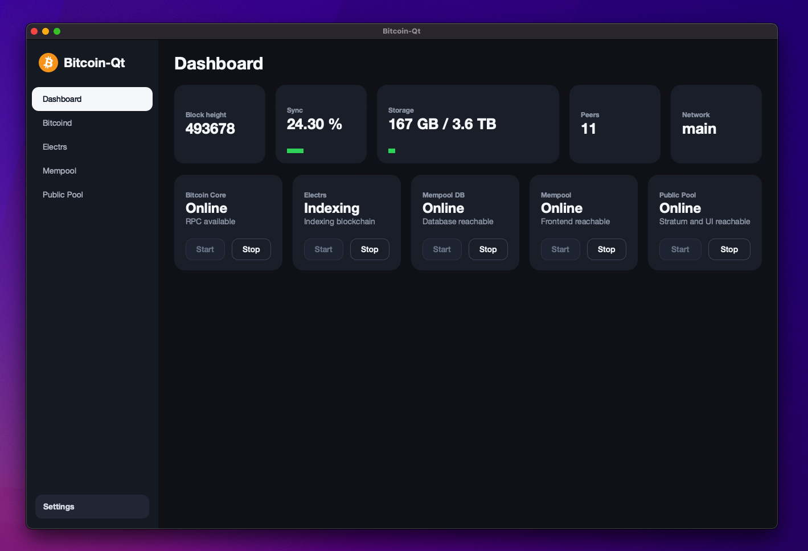

# Bitcoin-Qt



Native Qt 6 desktop application for managing a local Bitcoin full node stack:

- Bitcoin Core (`bitcoind`)
- electrs
- MariaDB for the local Mempool database
- Mempool backend
- Mempool frontend embedded with Qt WebEngine / Chromium
- Public Pool backend
- Public Pool frontend embedded with Qt WebEngine / Chromium

The app asks for a storage location on first start. Choose an external drive if
the full node data should live outside the system disk.

## Features

- Native Qt Widgets desktop shell with embedded Chromium WebViews
- Per-service start/stop controls and persisted service state
- First-run disk selection for running the full node from an external drive
- Dashboard with Bitcoin Core sync progress, peer count, Mempool state, Public
  Pool state, and storage usage
- Dedicated sidebar pages for Dashboard, Bitcoind logs, electrs logs, Mempool,
  Public Pool, and Settings
- Persisted WebView navigation for Mempool and Public Pool pages
- Local-only service orchestration through `QProcess`
- Qt WebChannel bridge for future native/web integration

## Build

Required Qt modules:

- Qt Widgets
- Qt Network
- Qt Concurrent
- Qt WebEngine
- Qt WebChannel

Configure and build with a Qt installation available through
`CMAKE_PREFIX_PATH`:

```bash
cmake -S . -B build/Bitcoin-Qt \
  -DCMAKE_BUILD_TYPE=Debug \
  -DCMAKE_PREFIX_PATH="/path/to/Qt/6.x/<platform>"

cmake --build build/Bitcoin-Qt
```

If Qt is already discoverable by CMake, the shorter form works:

```bash
cmake -S . -B build/Bitcoin-Qt -DCMAKE_BUILD_TYPE=Debug
cmake --build build/Bitcoin-Qt
```

Example macOS command when CMake was installed as an app bundle:

```bash
/Applications/CMake.app/Contents/bin/cmake -S . -B build/Bitcoin-Qt \
  -DCMAKE_BUILD_TYPE=Debug \
  -DCMAKE_PREFIX_PATH="$HOME/Qt/6.8.3/macos"

/Applications/CMake.app/Contents/bin/cmake --build build/Bitcoin-Qt
```

Run the built app:

```bash
# macOS
./build/Bitcoin-Qt/Bitcoin-Qt.app/Contents/MacOS/Bitcoin-Qt

# Linux
./build/Bitcoin-Qt/Bitcoin-Qt

# Windows
.\build\Bitcoin-Qt\Debug\Bitcoin-Qt.exe
```

## Runtime

The app owns its service runtime. It resolves binaries from `runtime/` during
development and from `Bitcoin-Qt.app/Contents/Resources/runtime` when
packaged.

Expected runtime layout:

```text
runtime/
  bitcoin/bin/bitcoind
  electrs/bin/electrs
  mariadb/bin/mariadbd
  mariadb/bin/mariadb-install-db
  node/bin/node
  node/bin/npm
  mempool/backend/
  mempool/frontend/
  public-pool/backend/
  public-pool/frontend/
```

Build all runtime components:

```bash
./scripts/build-runtime.sh
```

Build individual components:

```bash
./scripts/build-bitcoin-core.sh
./scripts/build-electrs.sh
./scripts/build-mariadb-runtime-macos.sh
./scripts/build-node-runtime.sh
./scripts/build-mempool.sh
./scripts/build-public-pool.sh
```

Version pins can be overridden:

```bash
BITCOIN_CORE_REF=v29.0 ELECTRS_REF=master MEMPOOL_REF=master NODE_VERSION=v24.13.0 \
  ./scripts/build-runtime.sh
```

`scripts/build-public-pool.sh` stages the current upstream Public Pool projects
from:

- `https://github.com/benjamin-wilson/public-pool`
- `https://github.com/benjamin-wilson/public-pool-ui`

The script builds the backend and Electron-style frontend, then writes a small
local frontend server so the UI can be loaded inside the Qt WebView.

The selected first-run storage directory is separate from `runtime/` and holds
mutable node data and logs:

```text
<selected-disk>/
  bitcoin/
  electrs/
  mempool-db/
  mempool/
  public-pool/
  logs/
```

Runtime artifacts are intentionally ignored by git. They are reproducible with
the scripts above and should not be committed to the repository.

## Service Startup

Services are controlled individually from the dashboard. Starting `bitcoind`
does not implicitly start electrs, Mempool, or Public Pool. The app persists the
last selected start/stop state per service and restores it on the next launch.

The expected dependency order is:

1. Start Bitcoin Core.
2. Wait until Bitcoin Core RPC is available and initial block download is
   complete.
3. Start electrs.
4. Start the Mempool database as an internal dependency of Mempool.
5. Start Mempool backend and frontend after MariaDB and electrs are reachable.
6. Start Public Pool after Bitcoin Core RPC is reachable.

Mempool uses the standard local Mempool backend, frontend, and MariaDB stack.
Bitcoin-Qt does not provide public mempool fallbacks or Bitcoin Core API
substitutes for Mempool while Bitcoin Core is still syncing; Electrs and
Mempool wait until the local node is fully synced.

Mempool and Public Pool are loaded locally in embedded Qt WebEngine views. The
app is designed to keep these pages inside Bitcoin-Qt instead of opening an
external browser. The last visited local page is saved per WebView and restored
on the next launch when it belongs to the same local service origin.

## macOS 12 Notes

Qt 6.11 requires macOS 13 or newer. On macOS 12.7.x, install a complete Qt
6.8.x or 6.9.x macOS kit with these add-ons selected:

- Qt WebEngine
- Qt WebChannel
- Qt Positioning

The Qt Maintenance Tool can fail with a `QmakeOutputInstallerKey` error when it
tries to install Qt 6.11 add-ons on macOS 12, because that kit's `qmake` cannot
run on the operating system. Use a macOS-12-compatible Qt kit instead.
